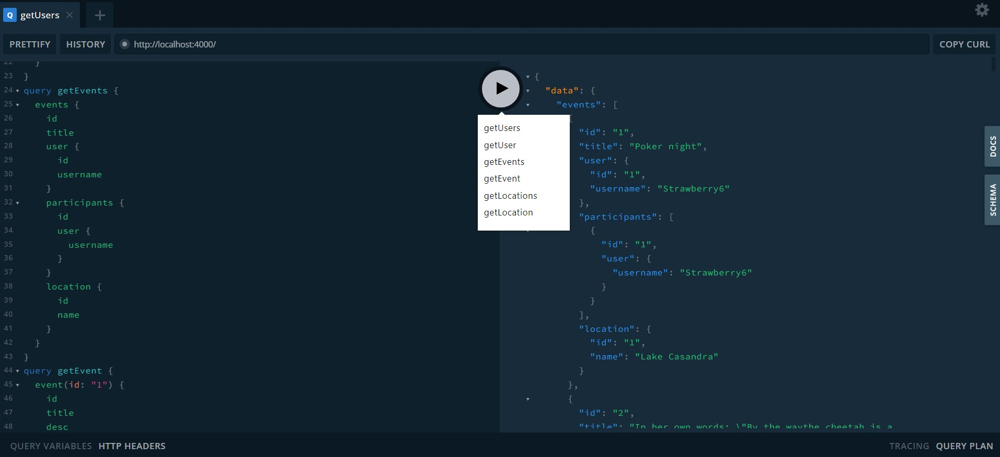

# GRAPHQL-ACTIVITY-TRACKING

## Temel olarak User, Event, Location ve Participant tipleri oluşturuldu.Bu tiplerle alakalı fieldlar veri seti üzerinden görüntülenebilir.

### Bir User'a ait bir veya birden fazla Event olabilir
### Bir Event, bir User ile ilişkilidir.
### Bir Event, bir Location ile ilişkilidir.
### Bir Event birden fazla Participant ile ilişkilidir.
# User
### User ekleyecek Mutation yazıldı.
### User'ı güncelleyecek olan Mutation yazıldı.
### Bir User'ı silecek olan Mutation yazıldı.
### Tüm User'ları silecek olan Mutation yazıldı.
    * mutation addUser 
    * mutation updateUser
    * mutation deleteUser
    * mutation deleteAllUsers

# Event
### Event ekleyecek Mutation yazıldı.
### Event'i güncelleyecek olan Mutation yazıldı.
### Bir Event'i silecek olan Mutation yazıldı.
### Tüm Event'leri silecek olan Mutation yazıldı.
    * mutation addEvent 
    * mutation updateEvent
    * mutation deleteEvent
    * mutation deleteAllEvents

# Location
### Location ekleyecek Mutation yazıldı.
### Location'ı güncelleyecek olan Mutation yazıldı.
### Bir Location'ı silecek olan Mutation yazıldı.
### Tüm Location'ları silecek olan Mutation yazıldı.
    * mutation addLocation 
    * mutation updateLocation
    * mutation deleteLocation
    * mutation deleteAllLocations
# Participant
### Participant ekleyecek Mutation yazıldı.
### Participant'ı güncelleyecek olan Mutation yazıldı.
### Bir Participant'ı silecek olan Mutation yazıldı.
### Tüm Participant'ları silecek olan Mutation yazıldı.
    * mutation addParticipant 
    * mutation updateParticipant
    * mutation deleteParticipant
    * mutation deleteAllParticipants

  



```javascript 
function hello(){
    //Bu selam Mehmet Duran Kaya'nın selamıdır.
    console.log("Merhaba Varlık");
}

