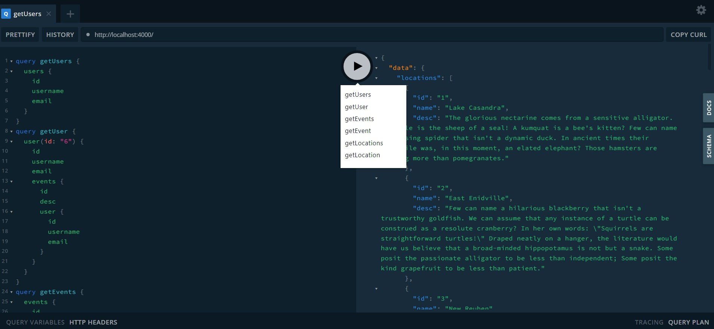

# GRAPHQL-ACTIVITY-TRACKING

## Temel olarak User, Event, Location ve Participant tipleri oluşturuldu.Bu tiplerle alakalı fieldlar veri seti üzerinden görüntülenebilir.

### Bir User'a ait bir veya birden fazla Event olabilir
### Bir Event, bir User ile ilişkilidir.
### Bir Event, bir Location ile ilişkilidir.
### Bir Event birden fazla Participant ile ilişkilidir.
  


```javascript 
function hello(){
    //Bu selam Mehmet Duran Kaya'nın selamıdır.
    console.log("Merhaba Varlık");
}

